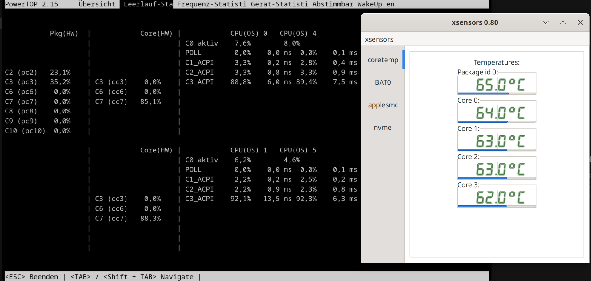
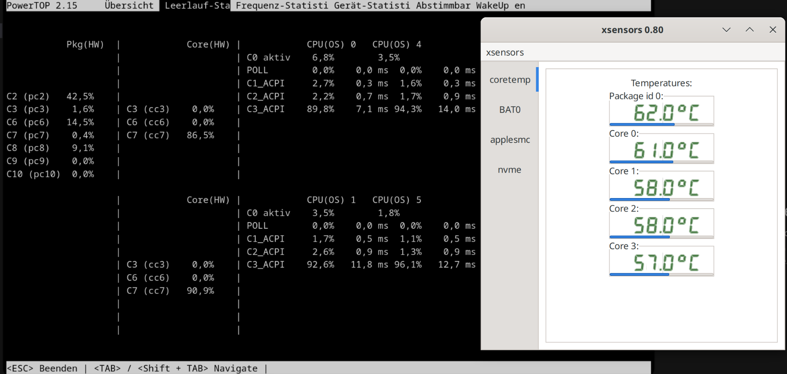

# ASPM Power Tuning for T2 Macs

Scripts to reduce idle power draw on Intel T2 MacBooks running Linux by enabling PCIe ASPM on relevant devices and applying `powertop --auto-tune`.

The goal is to reach the deeper package idle states that are missing out of the box on T2 Macs, especially the jump from package C3 to package C8. Reaching those deeper package states can have a dramatic effect on battery life and idle power draw, in some cases reducing idle consumption to half of the original level when using your Mac for light tasks like browsing, writing text etc... It won't have much impact when you run heavy tasks.

## Example MacBook Air 2020 9,1

This shows before running the script. Because of ASPM disabled on the Broadcom wireless card we only have Pkg state C3



This is after running the script. We have enabled ASPM successfully and are now running in Pkg state C8. Idle temperatures have lowered a bit. Idle Power draw is substantially reduced from 8 to 4.5W on idle.



The main script can be run once in a non-persistent mode, so the result can be checked before the same setup is installed persistently with systemd.

## Files

- `pcie-aspm-tune.sh`: main interactive installer/runner
- `pcie-aspm-tune-uninstall.sh`: removes installed services and deployed helper files

## Usage

Run the main script as root:

```bash
sudo ./pcie-aspm-tune.sh
```

Recommended workflow:
1. Run it once without installing persistent services.
2. Test normal use and if all devices are working as expected.
3. Reboot and run again.
4. Only then install the optional services.

To remove installed components:

```bash
sudo ./pcie-aspm-tune-uninstall.sh
```

## Important Notes

- This is aimed at T2 MacBooks and similar setups where Broadcom Wi-Fi can block deeper package C-states.
- The boot service installs a managed copy under `/usr/local/sbin`. If you also enable the Broadcom suspend guard, the helper scripts, suspend hook, and resume restore service are installed as managed copies too, so the original project files can be deleted afterwards.

## How does it work? What does it do?

When you run `pcie-aspm-tune.sh`, it first checks that the required tools are available: `lspci`, `setpci`, and `powertop`. If any of them are missing, it tries to install them through the system package manager.

The script then scans all PCI functions visible on the system and keeps only the devices that actually expose PCI Express capability registers. For each PCIe device it reads:

- which ASPM modes are supported by the link
- which ASPM mode is currently enabled in the Link Control register

At the same time, it builds a protection map for Apple/T2-connected PCIe branches. Devices on those protected branches are intentionally skipped during the general ASPM tuning pass, because forcing ASPM there can destabilize the T2 subsystem.

For every non-protected PCIe device that supports ASPM, the script tries to enable the best ASPM mode that the device reports as supported:

- if the device supports `L1`, it enables `L1`
- if the device supports `L0s+L1`, it enables `L0s+L1`
- if the best supported mode is already active, it leaves the device unchanged

Every `setpci` write is verified by reading the register back again. If a device reports ASPM support but does not actually accept the new setting, that device is reported as a failure.

The script also generates `powertop` reports before and after the PCIe tuning pass and extracts a short summary of the deepest observed core and package C-states. This is meant to show whether the machine moved from shallow package idle states such as package `C3` toward deeper states such as package `C8`.

In addition to the PCIe ASPM changes, the script runs `powertop --auto-tune`, which will enable deeper C-states. Just enabling ASPM isn't enough. So in practice it does three things:

- enables supported PCIe ASPM states with `setpci`
- applies `powertop` runtime tunings
- shows a before/after summary of the observed idle-state behavior

If you choose persistent installation, the script installs a boot-time systemd service that reruns the same tuning logic automatically on every boot.

If Broadcom Wi-Fi/Bluetooth PCI devices are detected, the script can also install an optional suspend/resume protection path:

- a pre-suspend hook disables ASPM on the full Broadcom PCIe branch and saves the previous ASPM bits
- a post-resume service waits until the Broadcom PCIe endpoints and their drivers are back in a stable state
- only then does it restore the previously saved ASPM bits

This Broadcom-specific guard exists because some machines can reach deeper package C-states with ASPM enabled during normal runtime, but lose Wi-Fi or Bluetooth after suspend unless ASPM is temporarily disabled around the suspend/resume transition.
